# Spear Phishing Email Malicious Attachment WriteUp

> Austin Lai | July 29th, 2021

---

<!-- Description -->

WriteUp Regarding a Spam Email - Spear Phishing - Malicious Attachment

WriteUp with sanitized and generic information.

<!-- Description -->

<br />

## Table of Contents

<!-- TOC -->

- [Spear Phishing Email Malicious Attachment WriteUp](#spear-phishing-email-malicious-attachment-writeup)
    - [Table of Contents](#table-of-contents)
    - [Analysis](#analysis)
        - [Malicious activities reported by Endpoint Detection and Response EDR Solution](#malicious-activities-reported-by-endpoint-detection-and-response-edr-solution)
        - [Investigate through SIEM](#investigate-through-siem)
        - [Malicious Activities Triggered Details](#malicious-activities-triggered-details)

<!-- /TOC -->

<br />

## Analysis

### Malicious activities reported by Endpoint Detection and Response (EDR) Solution

- Events from EDR shown malicious powershell code execution
- Suspicious vbs scripts generated
- Logs captured powershell payload command

<br />

### Investigate through SIEM

- Information gathered from [ logs \| events ] as below:

    - First email seen
    - There was no relevant log shown in anti-spam
    - It was not reflected as spam.
    - Logs show the phishing email was forwarder to multiple recipients via group email
    - No relevant windows log can be found (relevant windows logs not collected)
    - No relevant endpoint security log can be found
    - It was not reflected as virus nor malware
    - No firewall log shown relevant event
    - No Web Isolation logs shown relevant event

<br />

### Malicious Activities Triggered Details

- Victim accidentally open the spam phishing email and clicked the attachment

- Checking and analysing the attachment name “MKT-M45631.tar”

    - It shown as POSIX tar archive file

        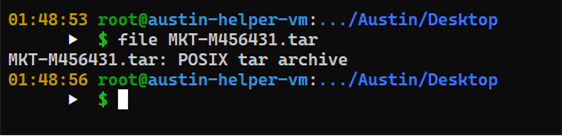

- However, it contains a vbs name “MKT-M456431.vbs”

    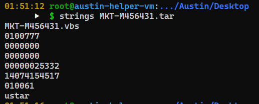

- Checking the head of the tar file, we can see the content of “MKT- M456431.vbs”

    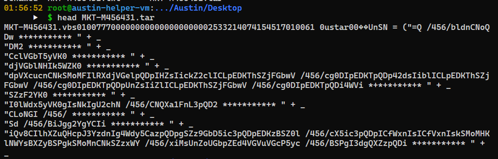

- By changing the malicious tar file extension from “tar” to “txt”

    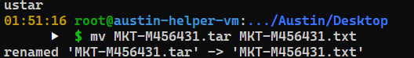

- Checking the content inside

    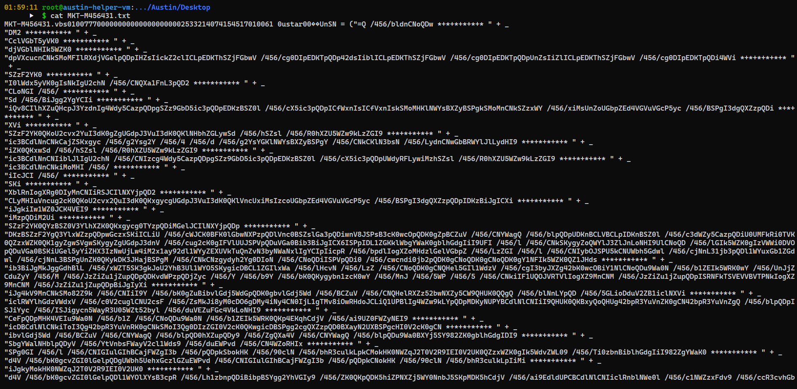

    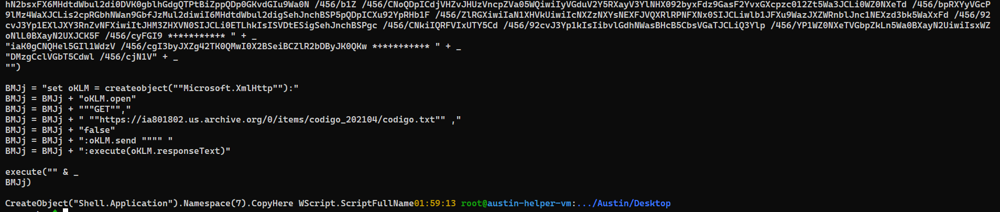

    - The malicious vbs execute a command that store in variable name “BMJj” connect and download a stager ``` https://ia801802.us.archive.org/0/items/codigo_202104/codigo[.]txt ```

    - The “codigo.txt” turn out is a JScript file and it create the object as vbs to execute the code by wscript.exe as show in the above.

- The variable name “UnSN” is an obfuscated command later on pass to the “codigo.txt” as shown below

    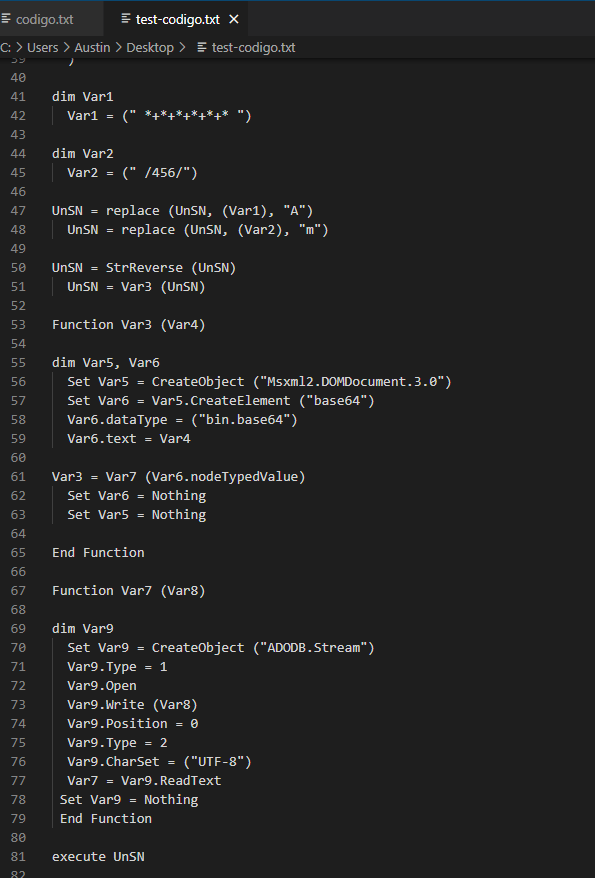

    - The variable name “UnSN” passed and used inside “codigo.txt”

    - It first de-obfuscated, then and reverse the string

- This is the strings after de-obfuscated and reversed and stored in “UnSN” variable

    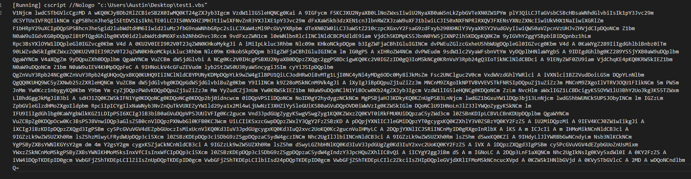

- Later on pass to function named “var3” to create XML Object with base64 encoded as binary

- The pass to function named “var7” to stream the encoded binary

- The initial vbs generate subsequent vbs until to get the full payload which will execute a PowerShell command that captured in Windows Event Log – PowerShell and falcon as shown below

    

- And the initial vbs named “MKT-M45631.vbs” remain on victim machines in order to re-generate subsequent vbs script that lead to EDR report multiple incident on following days

    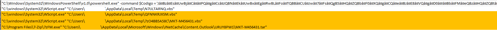

    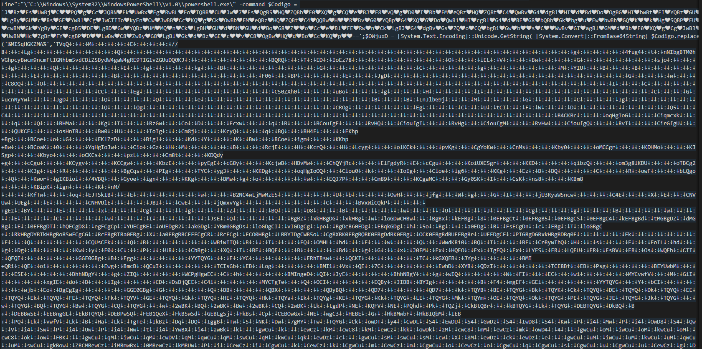

    - While we looked and dissect the PowerShell command

    - It is an obfuscated and base64 encoded string

- The first part was to replace the “love” symbol to character “A” and you will get base64 encoded strings as below

    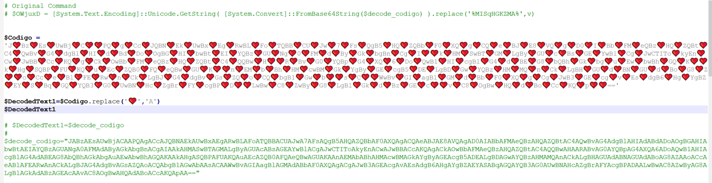

- The second part to decode it with base64 you will get below command

    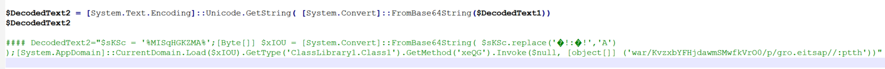

- There is a variable named “%MISqHGKZMA%” in the same PowerShell Command which is also an obfuscated strings.

- Based on the decode base64 strings, we now get the command to de-obfuscated variable named “%MISqHGKZMA%”

- As shown below, the variable named “%MISqHGKZMA%” was first pass to a function to replace symbol “↓:↓” to character “A” and then pass to function to decoded it with base64 and then it stored as a byte array variable named “$xIOU”

    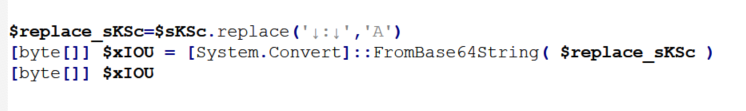

- Lastly, it use the vbs function to stream and load the binary as below

    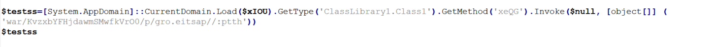

- Due to EDR terminate and blocked the process, there is no binary generated and there might missing some byte to re-create the malicious binary

---

> Do let me know any command or step can be improve or you have any question you can contact me via THM message or write down comment below or via FB
